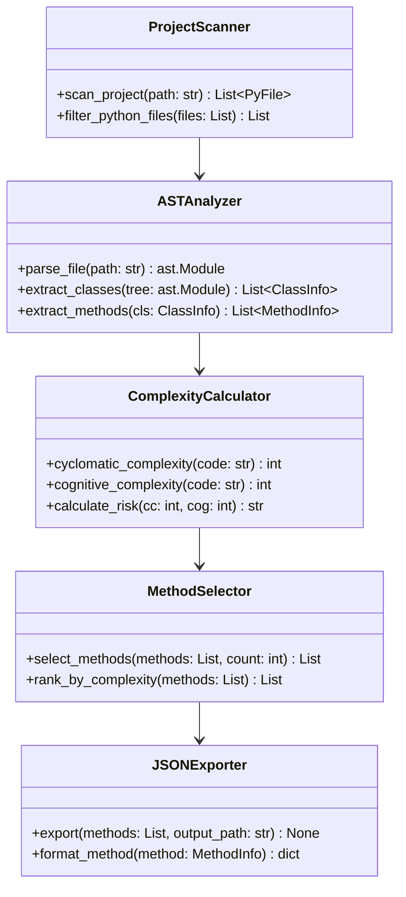

# Preprocess Module

Bu modül benchmark projelerini işleyerek her projeden **50 metot** seçer ve JSON formatında çıktı üretir.

## Kullanılacak Kütüphaneler

| Kütüphane | Açıklama | Kurulum |
|-----------|----------|---------|
| `ast` | Python AST parser (built-in) | - |
| `radon` | Cyclomatic complexity hesaplama | `pip install radon` |
| `cognitive_complexity` | Cognitive complexity | `pip install cognitive-complexity` |
| `pathlib` | Dosya yolu işlemleri (built-in) | - |
| `json` | JSON işlemleri (built-in) | - |

---

## Sınıf Diyagramı



---

## Oluşturulacak Dosyalar

```
src/preproces/
├── __init__.py
├── scanner.py          # ProjectScanner sınıfı
├── analyzer.py         # ASTAnalyzer sınıfı
├── complexity.py       # ComplexityCalculator sınıfı
├── selector.py         # MethodSelector sınıfı
├── exporter.py         # JSONExporter sınıfı
└── preprocess_readme.md
```

---

## Çıktı Formatı

Çıktı dosyası `output/selected_methods/` klasörüne kaydedilir:

```json
{
  "project": { "name": "project_name" },
  "file": { "name": "file.py", "path": "absolute/path" },
  "class": { "name": "ClassName", "fqn": "module.ClassName" },
  "method": {
    "name": "method_name",
    "signature": "def method_name(self, param: str) -> bool",
    "body": "...",
    "start_line": 10,
    "end_line": 20
  },
  "complexity": {
    "cyclomatic_complexity": 2,
    "cognitive_complexity": 1,
    "risk_levels": { "overall_risk": "LOW" }
  }
}
```

---

## Docker Entegrasyonu

```dockerfile
FROM python:3.11-slim

WORKDIR /app
COPY requirements.txt .
RUN pip install -r requirements.txt

COPY src/preproces/ ./preproces/
COPY benchmark/ ./benchmark/

CMD ["python", "-m", "preproces.scanner"]
```

```yaml
# docker-compose.yml
services:
  preprocess:
    build:
      context: .
      dockerfile: Dockerfile.preprocess
    volumes:
      - ./benchmark:/app/benchmark
      - ./output:/app/output
```
